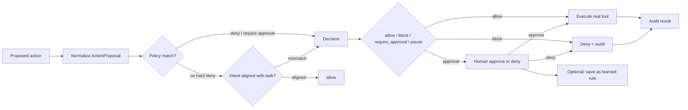
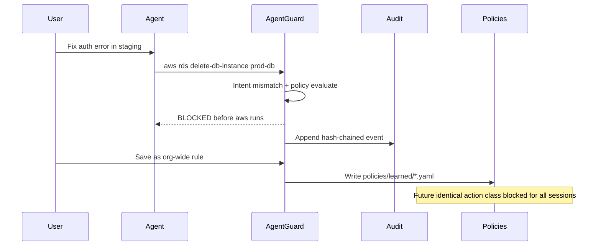

# AgentGuard

**Runtime security and governance for autonomous agents** — authorization, policy enforcement, and forensic replay.

AgentGuard is an enforcement and evidence layer between agents and the systems they act on: a **policy firewall** plus a **flight recorder**. It sits *outside* the agent, so the model never polices itself.

> Turn every human intervention into a permanent organizational control.

```text
Agent
  → Policy + permission gateway (AgentGuard)
  → Terminal / FS / HTTP / PostgreSQL / AWS
  → Tamper-resistant audit record
```

## Status

Verified locally:

| Check | Result |
|-------|--------|
| `go test ./...` | Pass |
| `go build ./cmd/agentguard` | Pass |
| `./scripts/demo.sh` (block → replay → save-as-rule → re-block) | Pass |

## What it can do

| Capability | What you get |
|------------|--------------|
| **Intercept tool use** | Wrap agents with `agentguard exec` so shell, filesystem, HTTP, PostgreSQL (`psql`), and AWS CLI calls hit a gateway before execution |
| **Enforce YAML policy** | Default destructive pack + learned rules: allow, block, require approval, or pause-and-escalate |
| **Compare intent vs action** | Task like “fix staging auth” vs proposed prod DB delete → automatic block |
| **Map credential blast radius** | Label what AWS profiles, Postgres roles, and HTTP tokens can do vs the assigned task |
| **Human approval interlocks** | Pause high-risk actions for CLI/console approve or deny |
| **Learn from interventions** | “I blocked this — save as permanent rule” scoped to agent, repo, team, or org |
| **Immutable session replay** | Hash-chained audit timeline: instruction → decision → tool call → result |
| **Local control plane** | API + React console for sessions, blocked actions, approvals, policies, credentials, risk |

### Protected action surfaces

| Surface | How it is gated |
|---------|-----------------|
| Shell / filesystem | PATH shims (`bash`, `sh`, `rm`, `mv`, `chmod`) |
| HTTP / APIs | Local forward proxy via `HTTP_PROXY` / `HTTPS_PROXY` |
| PostgreSQL | `psql` shim + SQL classification (drop, truncate, bulk delete) |
| AWS | `aws` CLI shim (RDS destroy, IAM, secrets, CloudTrail, snapshots, …) |

### Default policy pack (examples)

Shipped in [`policies/default/destructive-pack.yaml`](policies/default/destructive-pack.yaml):

- Production / staging database destructive ops (approval required)
- Backup and snapshot deletion (deny)
- Unusual blast radius (`affected_records > 1000` → escalate)
- IAM privilege changes, secret exposure/rotation
- Disable logging, billing changes, mass file delete, large HTTP egress

## Architecture

```mermaid
flowchart TB
  subgraph agentSide [Agent process]
    Agent[Agent / CLI / npm agent]
  end

  subgraph gateway [AgentGuard gateway]
    Exec["agentguard exec / run"]
    Shims[PATH shims + HTTP proxy]
    Classify[Adapters classify ActionProposal]
    Policy[YAML policy engine]
    Intent[Intent comparator]
    Approve[Approval broker]
    Audit[SQLite hash-chain audit]
  end

  subgraph targets [Protected targets]
    Shell[Shell / filesystem]
    HTTP[HTTP APIs]
    PG[PostgreSQL]
    AWS[AWS APIs]
  end

  subgraph console [Control plane]
    API[Local HTTP API]
    UI[React console]
  end

  Agent --> Exec
  Exec --> Shims
  Shims --> Classify
  Classify --> Policy
  Policy --> Intent
  Intent -->|allow| targets
  Intent -->|block or pause| Approve
  Approve -->|approved| targets
  Classify --> Audit
  Approve --> Audit
  Audit --> API
  UI --> API
```



### Decision path for one action



### Intervention → permanent rule (the wedge)



## Quickstart

```bash
# Build
go build -o bin/agentguard ./cmd/agentguard

# Terminal 1 — control plane (API + web console)
./bin/agentguard serve

# Terminal 2 — wrap an agent command
./bin/agentguard exec --task "fix auth error in staging" -- \
  bash -c 'aws rds delete-db-instance --db-instance-identifier prod-db'
```

The destructive AWS command is classified and **blocked at the shim** before the real `aws` binary runs — no cloud credentials required for the demo.

Open **http://127.0.0.1:8787/** for the console (approvals, blocked actions, session replay, policies, credentials, risk).

## Category demo (non-interactive)

```bash
chmod +x scripts/demo.sh
./scripts/demo.sh
```

This proves the full wedge:

1. Starts `agentguard serve` on port **8797** (isolated data under `.agentguard-demo/`)
2. Runs `exec` with a staging fix task and a prod RDS delete — **blocked**
3. Prints the hash-chained session timeline and verifies integrity
4. **Save as rule** via `POST /api/v1/events/{id}/save-as-rule`
5. Confirms future identical action class is blocked by policy
6. Prints console URLs for replay

| Variable | Default | Purpose |
|----------|---------|---------|
| `AGENTGUARD_DEMO_PORT` | `8797` | API/console port |
| `AGENTGUARD_DEMO_DATA` | `.agentguard-demo` | Isolated SQLite + config |
| `AGENTGUARD_BIN` | `bin/agentguard` | Binary path |
| `AGENTGUARD_AUTO_DENY` | unset | Auto-deny approval prompts (safe for CI) |
| `AGENTGUARD_AUTO_APPROVE` | unset | Auto-approve (use with care) |

## CLI reference

```bash
agentguard serve                              # API + console
agentguard exec --task "..." -- <cmd>          # wrap process (shims + proxy)
agentguard run <preset> --task "..."           # presets: bash, sh, zsh, claude
agentguard session list                        # sessions from audit log
agentguard session replay <session-id>         # timeline JSON
agentguard session verify <session-id>         # hash-chain integrity
agentguard policy validate <file.yaml>
agentguard policy save-rule --proposal proposal.json --scope org
agentguard approve <request-id>                # resolve pending approval
```

## Web console

| Route | Purpose |
|-------|---------|
| `/approvals` | Approve / deny / save-as-rule |
| `/sessions` | Live and recent wrapped sessions |
| `/blocked` | Filterable denied actions |
| `/replay` | Immutable instruction → decision → tool timeline |
| `/policies` | Default + learned packs; enable/disable |
| `/credentials` | Credential scope / blast-radius view |
| `/risk` | Counts by agent, repo, rule, decision |

```bash
cd web && npm install && npm run build   # optional; serve prefers web/dist when present
cd web && npm run dev                    # Vite + API proxy to :8787
```

## Configuration

Edit [`agentguard.yaml`](agentguard.yaml):

```yaml
data_dir: .agentguard
policy_dir: policies
api:
  listen: 127.0.0.1:8787

credentials:
  aws_profiles:
    - profile: prod-oncall
      environment: production
      scope_labels: [iam:write, rds:admin, s3:full]
  postgres:
    - conn_ref: production-db
      host_pattern: "*.prod.example.com"
      environment: production
  http_tokens:
    - ref: github-api
      header_pattern: "bearer ghp_"
      scope_labels: [github:repo, github:write]
```

Policies: [`policies/default/`](policies/default/) (shipped) and [`policies/learned/`](policies/learned/) (from interventions).

## API surface

| Method | Path | Purpose |
|--------|------|---------|
| `GET` | `/health` | Liveness |
| `GET` | `/api/v1/sessions` | List sessions |
| `GET` | `/api/v1/sessions/{id}/events` | Session replay events |
| `GET` | `/api/v1/sessions/{id}/verify` | Verify hash chain |
| `GET` | `/api/v1/events?decision=block` | Filtered audit events |
| `POST` | `/api/v1/events/{id}/save-as-rule` | Learn rule from blocked event |
| `GET/POST` | `/api/v1/approvals…` | List / approve / deny / save-as-rule |
| `GET/PATCH` | `/api/v1/policies…` | List packs, enable/disable, rules |
| `POST` | `/api/v1/policies/evaluate` | Evaluate a proposal |
| `GET` | `/api/v1/risk/summary` | Risk aggregates |
| `GET` | `/api/v1/credentials/scopes` | Credential blast-radius |

## Tests

```bash
go test ./...
go test ./test/demo/... -v      # end-to-end: exec + audit + save-as-rule
```

## Project layout

```text
cmd/agentguard/          CLI entry
internal/
  intercept/             process wrap, shims, HTTP proxy
  adapters/              shell, fs, http, postgres, aws classifiers
  policy/                YAML engine + learned rules
  intent/                task vs action heuristics
  credentials/           blast-radius scope mapper
  approval/              CLI/UI approval broker
  audit/                 SQLite hash-chain store
  api/                   control-plane HTTP + embedded UI
  session/               session lifecycle
policies/default/        built-in destructive pack
policies/learned/        rules from interventions
web/                     React console (Vite)
scripts/demo.sh          category demo
test/demo/               end-to-end tests
docs/PRODUCT.md          product vision
```

## Honest limitations (MVP)

- Agents that **bypass** `agentguard exec` are out of band — not a kernel sandbox
- Credential scope uses **configured labels** (not full live IAM simulation)
- Intent checks are **heuristic** (no LLM as sole enforcer)
- Local single-node control plane — not multi-tenant SaaS yet

See [docs/PRODUCT.md](docs/PRODUCT.md) for positioning and roadmap context.
