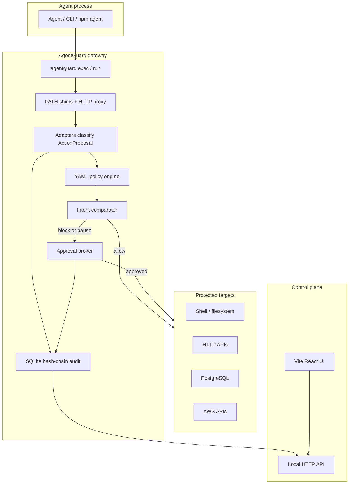

# AgentGuard

**Runtime security and governance for autonomous agents** — authorization, policy enforcement, and forensic replay.

AgentGuard is an enforcement and evidence layer between agents and the systems they act on: a **policy firewall** plus a **flight recorder**. It sits *outside* the agent, so the model never polices itself.

> Turn every human intervention into a permanent organizational control.

**Live site:** [https://amulyavarshney.github.io/agentguard](https://amulyavarshney.github.io/agentguard) — landing, production guide, interactive policy playground, and console tour (static demo data).

```text
Agent
  → Policy + permission gateway (AgentGuard)
  → Terminal / FS / HTTP / PostgreSQL / AWS
  → Tamper-resistant audit record
```

## What it can do

| Capability | What you get |
|------------|--------------|
| **Intercept tool use** | Wrap agents with `agentguard exec` so shell, filesystem, HTTP, PostgreSQL (`psql`), and AWS CLI calls hit a gateway before execution |
| **Enforce YAML policy** | Default destructive pack + learned rules: allow, block, require approval, or pause-and-escalate |
| **Compare intent vs action** | Task like “fix staging auth” vs proposed prod DB delete → automatic block |
| **Map credential blast radius** | Label what AWS profiles, Postgres roles, and HTTP tokens can do vs the assigned task |
| **Human approval interlocks** | Pause high-risk actions for CLI/console approve or deny |
| **Learn from interventions** | “I blocked this — save as permanent rule” scoped to agent, repo, team, or org |
| **Immutable session replay** | Hash-chained audit timeline: instruction → decision → tool call → result |
| **Local control plane + web UI** | Vite/React site: playground, production guide, and ops console |

### Architecture



## Production usage

AgentGuard is **not** a cloud SaaS that wraps every agent automatically. Production means:

1. Run a **control plane** (`agentguard serve`) on an internal host with shared `data_dir` + `policies/`.
2. Require every agent/CI job to start via **`agentguard exec`** (or `run`) so shims and the proxy are injected.
3. Map credentials in `agentguard.yaml`, grow `policies/learned/` from real blocks, and put the console behind VPN/SSO.

```text
┌──────────────────────────────────────────────┐
│  Control plane (always on)                   │
│  agentguard serve                            │
│  • API + UI (internal)                       │
│  • SQLite audit + policies on shared volume  │
└──────────────────────────────────────────────┘
                 ▲ writes audit
┌──────────────────────────────────────────────┐
│  Agent hosts (CI, laptops, runners)          │
│  agentguard exec --task "…" -- <agent>       │
└──────────────────────────────────────────────┘
```

Details: [Production guide on the live site](https://amulyavarshney.github.io/agentguard/production) or run the UI locally and open `/production`.

**CI tip:** `AGENTGUARD_AUTO_DENY=1` fails closed when an approval would be required.

## Quickstart (local binary)

```bash
# Build Go binary
go build -o bin/agentguard ./cmd/agentguard

# Optional: build UI into web/dist (served by agentguard serve)
cd web && npm install && npm run build && cd ..

# Terminal 1 — control plane
./bin/agentguard serve
# → http://127.0.0.1:8787/

# Terminal 2 — wrap an agent command
./bin/agentguard exec --task "fix auth error in staging" -- \
  bash -c 'aws rds delete-db-instance --db-instance-identifier prod-db'
```

The destructive AWS command is **blocked at the shim** before the real `aws` binary runs.

### Web UI locally

```bash
cd web
npm install
npm run dev          # http://localhost:5173  (proxies API to :8787)
```

| Route | Purpose |
|-------|---------|
| `/` | Landing |
| `/playground` | Interactive client-side policy simulator |
| `/production` | Production topology & hardening guide |
| `/console/*` | Ops console (live API when `serve` is running) |

### Static GitHub Pages build

```bash
cd web
npm run build:pages   # base=/agentguard/, VITE_STATIC=true
npm run preview:pages
```

Pages deploy is automated via [`.github/workflows/pages.yml`](.github/workflows/pages.yml) on push to `main` (this repo only — not `amulyavarshney.github.io`).

## Category demo

```bash
chmod +x scripts/demo.sh
./scripts/demo.sh
```

Proves: block → hash-chain replay → save-as-rule → re-block.

## CLI reference

```bash
agentguard serve                              # API + UI
agentguard exec --task "..." -- <cmd>          # wrap process
agentguard run <preset> --task "..."           # bash | sh | zsh | claude
agentguard session list | replay | verify
agentguard policy validate <file.yaml>
agentguard policy save-rule --proposal proposal.json --scope org
agentguard approve <request-id>                # via running serve API
agentguard approve <request-id> --deny
```

## Configuration

See [`agentguard.yaml`](agentguard.yaml) for `data_dir`, `api.listen`, and credential blast-radius labels. Policies live in [`policies/default/`](policies/default/) and [`policies/learned/`](policies/learned/).

## Tests

```bash
go test ./...
go test ./test/demo/... -v
cd web && npm run build && npm run build:pages
```

## Project layout

```text
cmd/agentguard/          CLI
internal/                gateway, adapters, policy, intent, audit, api
policies/                default + learned YAML
web/                     Vite + React (landing, playground, console)
scripts/demo.sh          category demo
test/demo/               end-to-end Go tests
docs/PRODUCT.md          product vision
.github/workflows/       GitHub Pages deploy
```

## Honest limitations (MVP)

- Agents that bypass `agentguard exec` are ungated (not a kernel sandbox)
- Credential scope uses configured labels (not full live IAM simulation)
- Intent checks are heuristic; policy remains authoritative
- GitHub Pages is documentation + playground only — **no remote enforcement**

See [docs/PRODUCT.md](docs/PRODUCT.md) for positioning.
